# NAS Homelab - 6 Months In
My Experience running Unraid

## Planning

### Why?
Last summer I decided I wanted to put together a NAS. Why? Well…

1. Thanks to my obsessive usage of [Nvidia Shadow Replay](https://www.nvidia.com/en-us/geforce/geforce-experience/shadowplay/), I had [eight years worth of gameplay and Mumble voice-comms](https://skyborne.net/movie) totaling around 800-some-odd gigabytes that was only getting bigger. I wanted to move these files somewhere slightly safe, and I figured some sort of data redundancy (via RIAD) was the easiest way to protect my data while still keeping it live and ready for new additions.
2. Was spending more time off my LAN and wanted easier access to my files, but wasn't about to increase my electricity bill by 10x by leaving my desktop on 24/7 to remote into.
3. Found myself spending more time transferring large files between my laptop and desktop machines and figured I could do with some sort of centralization for my files.
4. But mainly; I had just received my first direct deposit from a job that paid above MA minimum wage, and knew I had to act fast before I felt obligated to put it towards my student loans.

_Or at least those are the reasons I used to justify opening my wallet._

### The Hardware
Off the bat I didn't want to go for any pre-built solution, as that just felt kinda lame and uninspired. It would have made this post a lot shorter and saved me a lot of future stress – and I guess therefore learning experiences –, so like, what would the point be?

Starting out with the hardware I wanted to use, I figured I would put the old shell of my gaming rig to use. The case was the now discontinued Corsair Air 240, a small (maybe too small, I was never able to fit the acrylic side panel on because of my GPU's heat pipe) micro-ATX cube case. A bit of a quirky case, but I certainly prefer it over a standard tower case. It's also the perfect dimensions to fit onto [into?] a shelf in my living room while still leaving room for airflow.

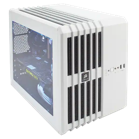

The circa 2014 case has long since been discontinued, but I have recently come across its bigger sibling (the 540) sold by Lambda Labs for some of their "ML workstations" (They seem to love how easily the magnetic Corsair log can be replaced with their own).

The case still had an [ASRock H81M-HDS](https://www.asrock.com/mb/Intel/H81M-HDS/) motherboard and _i5-4690K_ I had left in it, along with my old coil-whining GTX 970. I popped the 970 out as I didn't want to pay for all that extra electricity, and I figured the CPU could handle some light transcode loads on its own (it can).

The ASRock board is definitely in the 'budget' class and comes with an entertaining listing of "unique features" (half are Windows programs, the other half are pretty standard motherboard features) that take up a few pages in the manual:

- **_ASRock APP Shop_** (Easily install Norton by accident while you try to update your BIOS)
- **_ASRock A-Tuning_** (Software to easily over-overclock your system)
- **_ASRock Instant Flash_** (You can flash the BIOS in the same every motherboard since I was born allows you to)
- **_ASRock APP Charger_** ("quickly charge many Apple devices simultaneously" ???)
- **_ASRock XFast USB_** ("...redefines a new standard in high performance computing. Hundreds of hardworking engineers at ASRock dedicated hours and days to make immediate boosts possible," i.e., a file transfer program for USB 2.0 that performs - in some specific cases - better than File Explorer)
- **_ASRock XFast LAN_** (Packet management so good "you can watch YouTube HD videos and download simultaneously")
- **_ASRock XFast RAM_** (Some memory optimizations for 32-bit windows?)
- **_ASRock Crash-less BIOS_** (lmao)
- **_ASRock OMG_** (Parental management of ethernet)
- **_ASRock Internet Flash_** (Common feature these days; flash the BIOS from ASRock server)
- **_ASRock System Browser_** (BIOS feature; you can see what SATA drives you have connected...)
- **_ASRock UEFI Tech Service_** (An email you can contact)
- **_ASRock Dehumidifier_** (Turns on fans when PC is sleeping to dehumidify the MOBO??)
- **_ASRock Easy Driver Installer_** (ok.)
- **_ASRock Interactive UEFI_** (A… UEFI….)
- **_ASRock Fast Boot_** (Fast Boot)
- **_ASRock Restart to UEFI_** ("Windows 8 brings the ultimate boot up experience. The lightning boot up speed makes it hard to access the UEFI setup… By enabling this function, the PC will enter the UEFI directly after you restart.")
- **_ASRock USB Key_** (Kinda fun feature, log into Windows with USB auth key)
- **_ASRock FAN-Tastic Tuning_** (You can change the fan speed in BIOS)

As for the MOBO features I actually care about:

-	2 ports each for SATA2 & SATA3, not ideal, but I guess it doesn't matter for HDDs.
-	1 PCIe x16, 1 PCIe x1. Really wish it just had two x16 lanes, or a slightly bigger than x1 lane.

The CPU cooler was missing a fan blade (these things happen when you are missing a side panel), but never troubled me when I was gaming on it, so I figured I'd keep it  in.

_**But yeah, TL;DR I took my old gaming pc, and removed the graphics and Wi-Fi cards, and called it a server.**_

### The OS

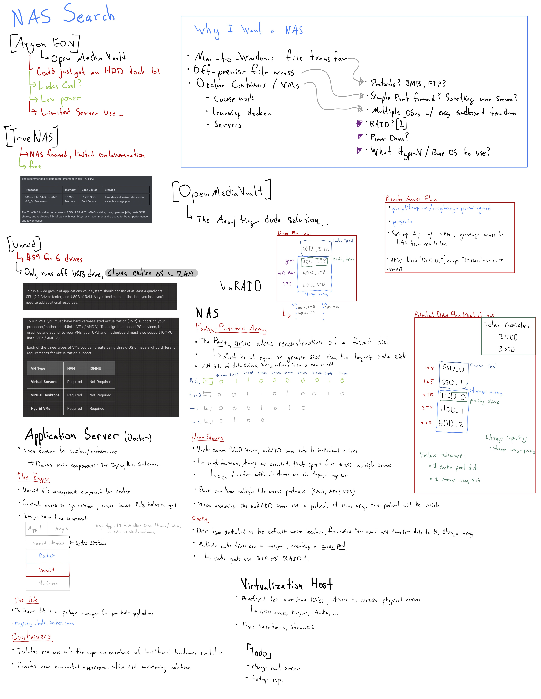

The main two contenders were TrueNAS and Unraid, but a quick glance was had at some Raspberry Pi based NAS software. However, a quick look at this document and the astute among us (sarcasm + ඞ) might recognize that the small column in the top right consists of the different options and the other 99% (joke) of the page is about the inner workings of Unraid. So, yeah. I pretty quickly fell in love with Unraid's feature set. Mainly:

* Not true RAID, so any-old hard drives of random sets of capacities can be used (more budget friendly).
* Docker. Docker has always been – and honestly, still is – something that I feel I've never truly gotten the hang of, despite using it all the time. I hoped that using a system that relied on docker containers for its applets would teach me more about the fundamentals of docker and get me up to speed with some of the docker wizards I see online.
* Comfortability. LimeTech has good introduction documentation on the technologies unraid uses, and I was confident in using an OS that I understood the underlying infrastructure of, from the filesystem to the Docker engine.

## Setting Up Unraid
_Early May_

### The USB Creator Tool, a Tale of Woe
Starting with the [Getting Started](https://wiki.unraid.net/Articles/Getting_Started) article. It tells me to check that my hardware is compatible. Looks like I need a flash drive that is "2GB or larger". I got my trusty Corsair Flash Voyager Slider 32GB, I'm sure that will work just great! I pulled up the official USB Creator Tool and get to flashing the OS onto the drive. It Hangs.

Okay, further research on the forums tells me that USB 3.0 drives are not well-supported.

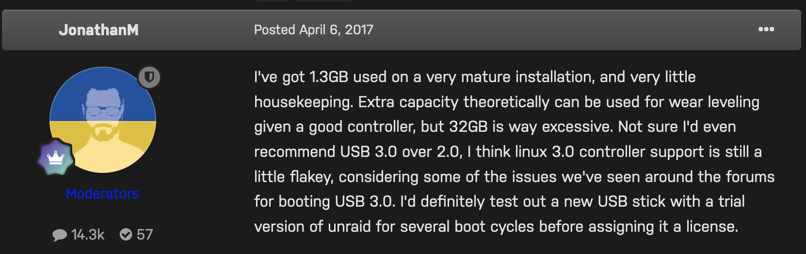
Ok weird, but sure. I'll pop in one of my random generic USB 2.0 drives. The flash tool doesn't recognize it at all. I tried reformatting the drive and still no luck. [This](https://www.reddit.com/r/unRAID/comments/fmrngk/unraid_usb_creator_cant_find_usb/) reddit thread suggests I try the manual installation. Ok sure. I did that and plugged it into my server. Got a [new error](https://www.reddit.com/r/unRAID/comments/fmrngk/unraid_usb_creator_cant_find_usb/). I guess my drive is corrupted? Ok try another drive with the USB tool. It doesn't see it. I decided to try it on my Mac with a USB-A to C adapter. It shows up, formats, and boots unraid! Alright, it took me a couple nights, a handful of flash drive candidates, and two computers to get there, but it's working now, and I'm in the OS.

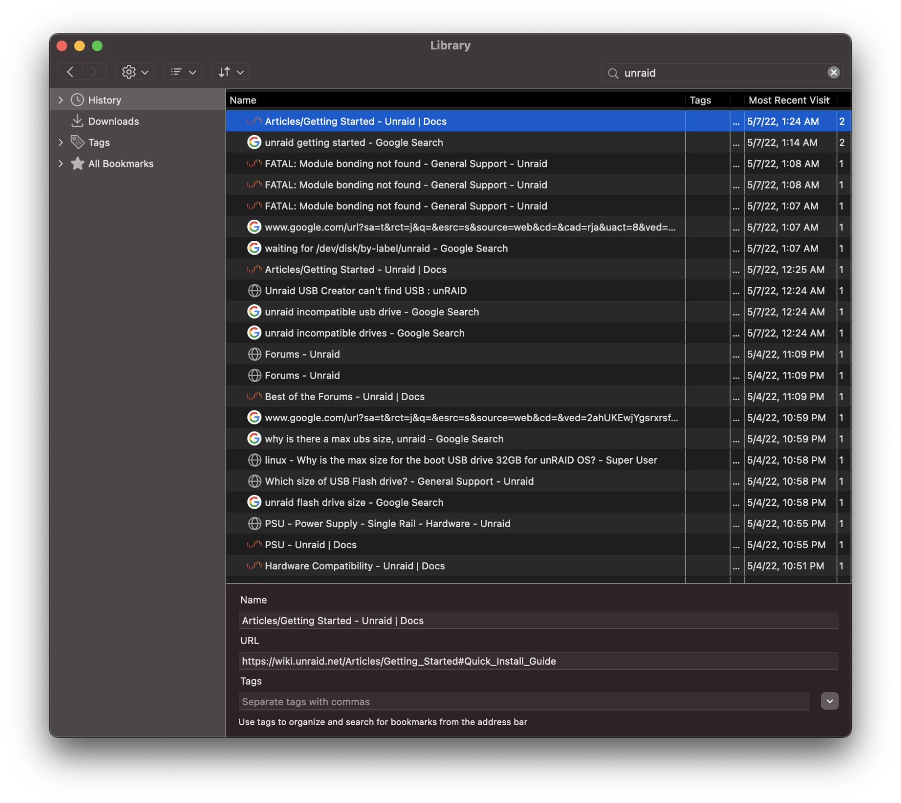
So not a great start, but I'm happy its up and working.

### Docker in Unraid
So Docker in Unraid isn't all I thought it would be.
First off, adding a docker container is done through the Community Applications (CA) extension.
From my understanding this was a user built extension that was recently merged [kinda] into Unraid (an interesting pattern I see with a lot of Unraid features) in release 6.10.
I say 'kinda' as they include the button for it in their UI by default, but will prompt you to download the external plugin if you don't already have it installed. CA is definitely a key part of Unraid – so much so that they have had a [dedicated page](https://unraid.net/community/apps) for it on their site since at least Oct 2020 ([archive](https://web.archive.org/web/20201218234535/https://unraid.net/community/apps)), and I'd say it's been the de facto Docker installer for Unraid since well before then. Every tutorial you find (even the official ones!) will point you there first.

Why is it loved so much? Well, the actual Unraid manager for docker isn't all that great:

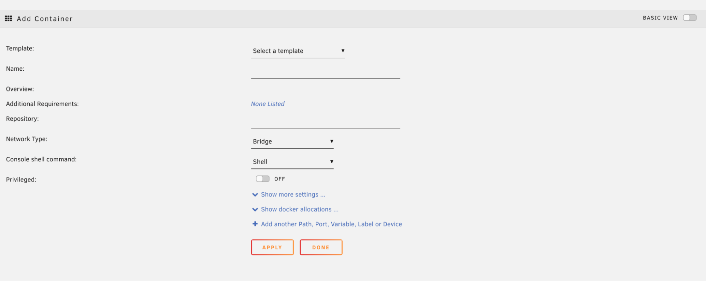

The template dropdown by default includes Plex, Sync, sysdream, and UnraidNet. It will appear more populated once you set up CA, and install some apps from there.

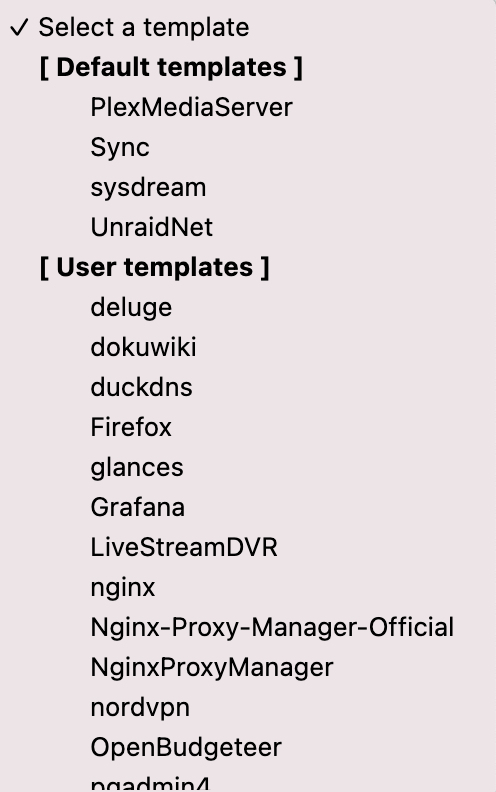

As I'm about to complain about how hard this interface is to use, I just came across this line in the [official Unraid Docker documentation](https://wiki.unraid.net/Manual/Docker_Management#Adding_Applications_as_Containers); "**This method [the built-in docker system] is now deprecated and the recommended way to add all containers is via Community Applications**". So now I get to shift my complaint from 'it is hard to install your own Docker apps,' to 'Unraid _does not officially support_ docker natively'. Well I guess they technically support it natively, as the system has Docker installed and kept up to date, but they don't support it via the GUI without 3rd party tools. So now support for Dockerization has moved off LimeTech's plate and onto that of this [157-page forum thread](https://forums.unraid.net/topic/38582-plug-in-community-applications/), and support for specific containers to [this sub-forum](https://forums.unraid.net/forum/47-docker-containers/).

This is a trend I see often with Unraid. Having an issue? Dig through this long forum thread and try to find the most up-to-date advice for your problem. Their own documentation even links to these forum threads in places, telling you they are sources of truth for a particular feature set or fix.

So when you want to add a container that is not included in CA you can either use this deprecated Docker interface, or create an [XML template for CA](https://wiki.unraid.net/DockerTemplateSchema). This immediately adds a strong learning curve for what translates to a `docker run` with an argument or two.

This whole experience made me realize the audience for unraid is probably those who want a quick NAS setup, with maybe a few curated applications, and not anymore 'advanced' users. Even many basic tasks you would want to run on the command line involve installing the "nerdpack tools" plugin.

## HotDiskDrives
_July_

During the hot summer months unraid was sending me 20-some-odd hard drive temperature warnings a day alerting me of over 60deg. The Air 240 is a dual chamber design, keeping airflow on the PSU and disk side fully separate from the MOBO side. I considered buying [this 3D printed fan mount](https://archive.ph/OWwhN) to replace the HDD cage cover.

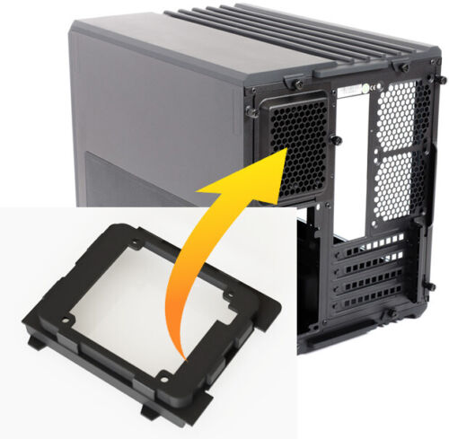

Though, ultimately I decided I could just do the equivalent myself and glued a fan grill to the rear and attached the fan to that.

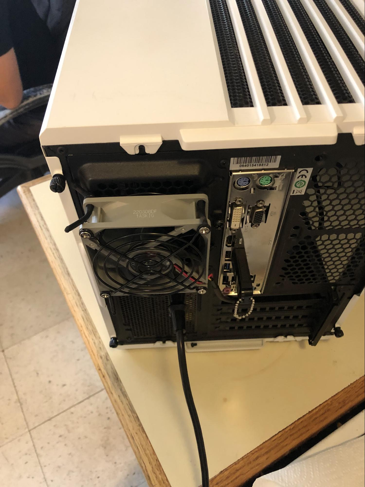

## Upgrading the Network
_Mid to Late August_

After dealing with the slow transfer of some of my larger files, I decided I wanted to speed things up a notch and take a stab at some networking tech. With my primary goal being to speed up connection between my desktop and my server, I set out on some research. I knew my current desktop computer had a 2.5G ethernet NIC and that I could get some sort of networking expansion card to fill one of the PCI-E lanes in my NAS. I started by looking around at 10G switches but was surprised to see how expensive they were compared to a regular 1 gig switch, even the budget/consumer-friendly 2.5G options. All leaning over the $150 range for equipment to _connect_ some >1G devices. I asked a coworker at my IT job for some advice, and he directed me to [fs.com](https://www.fs.com/), and recommended I skip the switch altogether and just get a dual-NIC card to directly connect my PC to my server and from each to my router. While good advice to save money, I also wanted something I could incorporate more machines into – something more long term, so I kept looking at switch options. I had almost settled on the cheapest 2.5G switch I could find on AliExpress and Taobao, when this coworker gave me a dual-NIC SFP+ card and told me it could disappear from the office, which I gladly accepted. I admit I didn't really know what SFP was and had to google around for a bit to figure out what I needed to get a setup up and running with this. Of course, SFP+ switches are even more expensive than your regular RJ45 ones, but luckily the DIY home networking community seems to pretty unanimously love and recommend the [Mikrotik CRS305-1G-4S+IN](https://mikrotik.com/product/crs305_1g_4s_in#fndtn-specifications). At $160 it was practically the single-most cheapest SFP+ switch on the market, all-the-while offering solid I/O with 4 SFP+ ports and 1GbE uplink. The only immediate downside was the lack of 2.5G negotiation. However, there exists a quick fix for this in the form of an SFP+ module – the [S+RJ10](https://mikrotik.com/product/s_rj10#fndtn-downloads) – that can pull some special tricks to negotiate down to 2.5G. The caveat being it is intended for actively cooled switches, which the CRS305 is not. This is only a constraint due to how hot the module will get without fans to cool it off. Well, It just so happened the ventilation holes atop the switch lined up perfectly with a 20mm fan, so I bought [one](https://noctua.at/en/nf-a4x20-flx) and "attached" it with some anti-vibration rubber fan mounts and added a small grill atop the fan to make it seem slightly harder for the blades to snag a stray cable. I used the USB port on my router to supply power via a USB to 3-pin fan adapter

[//]: # (TODO INSERT PHOTO!)

It would probably fall right off if shaken or flipped, but it does the trick.

## The Final Upgrade: PSU
The last thing I wanted to do for the near future for the server was to upgrade its power supply. It was currently running a seven-year-old bronze rated Corsair PSU that I was never super comfortable running all my valuable data off of. So I shopped around (opened PC part-picker, selected all 80+ Gold and above ratings, around 500-700 Watts) and decided on the 650W Platinum rated EVGA SuperNOVA 650 P2. Discounted on the manufacturer's website for $63 total, I was surprised how low it was below its usual $110+ price range. 

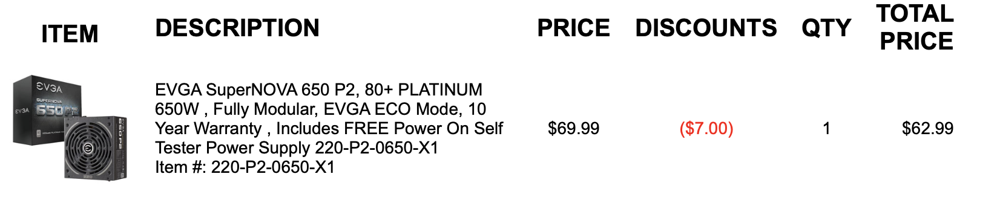

When the PSU came I got right to plugging it in, replacing the dusty old PSU with this new one. Coming in at a surprising full inch or so bigger than the previous power supply, but it fit just fine. Quick and easy installation, plugged it in and turned it on. I see the OS boot just fine, so I go off and eat dinner. I come back and go to start the array and am surprised to see none of my HDDs, nor my cache SSD are recognized, with unRAID telling me there is "no devices" in the drive selection dropdown.

I decided to replace the SATA Power cable and I noticed something not quite that cool. The pin-outs are different. The cables look the exact same from anywhere other than the tiny metallic pin-outs inside the power supply end (though one is certainly more dusty than another). Turns out ([source](https://superuser.com/questions/1715077/new-psu-not-providing-power-to-hard-drives)) Corsair does this:

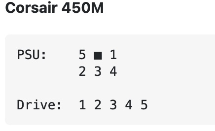

While EVGA does this:

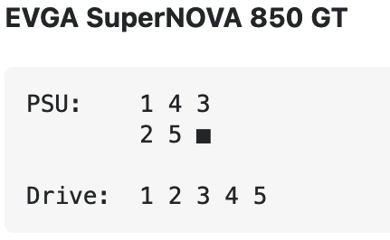

How I would ever know that is a mystery. When I mentioned this to friends only a few said they had vaguely heard something about this being a discrepancy between manufactures. Well whatever, I'll swap the cables over to the correct ones and reboot. Nope. No devices detected. No disk spin at all, even.

Well this wasn't good lol.

Googling around in despair I find that almost everyone everywhere seems to either reference or copy/paste their answer to the "I used the wrong PSU cable" problem from [this hddoracle.com thread](https://archive.ph/8giHG). So to sum it up there is a Transient Voltage Suppression (TVS) diode on the inner-side of the exposed PCB on the back of the drive whose job is [includes] to prevent overvoltages from making it to the inner-workings of the drive by short-circuiting itself out.

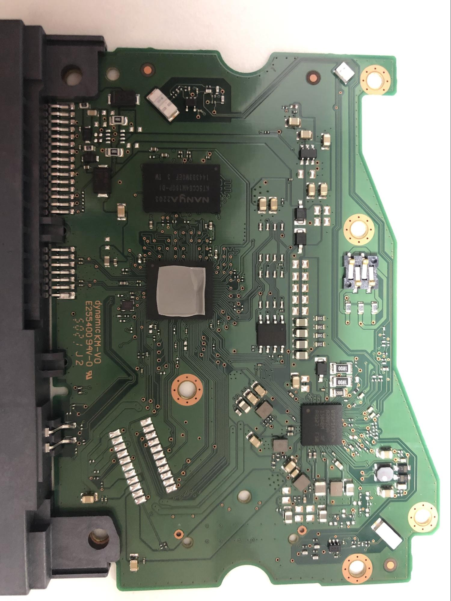

Well I borrowed a fancy-schmancy multimeter from a lab at my Uni and fumbled around till I found a page in the manual online that sounded like what I was looking for.

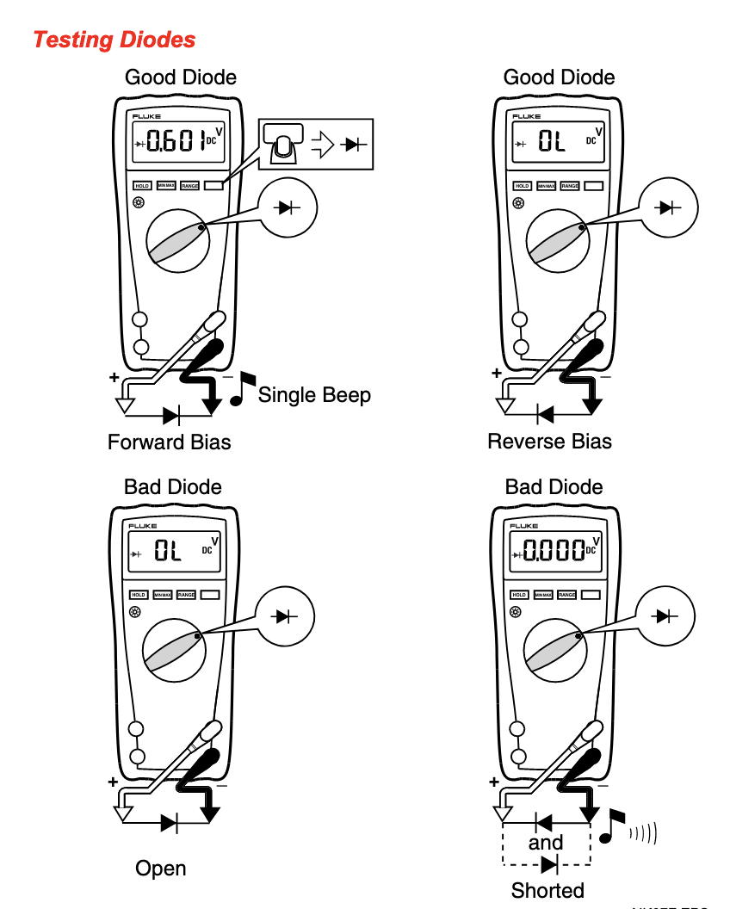

Well sadly I only got a single beep: the diode had not tripped. Meaning the over-voltage was probably sent nowhere good and all my data was housed on expensive bricks.

I contacted some repair and recovery shops, but the lowest quote I got was $750 as the best case scenario for my smallest (3TB) drive, which was not really within a reasonable budget for me. Even my SSD used for caching data was toast. In fact, it was slightly more toast than the hard drives in the sense that it had clearly burned up in some parts and made some computer chip toast.

## Rebuilding
After looking around my files I found that I luckily had an older copy (about 6 months outdated) of my Shadow Replay collection on one of my desktop drives. As for my "Linux ISOs" I had nothing super rare or hard to find, so I was able to get back to torrenting them all back into my Plex library. The big thing I haven't got set back up again is my personal documents and things like encrypted recovery codes as that all takes some time to re-assemble.
 
The biggest annoyance was really just the dollar cost to get back up and running. I made the morally dubious decision to return one of my 6TB drives as defective to Amazon, and shelled out the additional money for another 6TB. Still not back up to my original capacity, but I don't need it yet, so I'll probably be holding off on that for a bit.

As for lessons learned:

* Yes, it might be too expensive to back everything up. Doesn't mean it is too expensive to back anything up.
* SATA Power doesn't make much sense on the PSU side, so don't mix cables
* Unraid lies in a weird in-between of not requiring much technical skills, until you want to step even the slightest out of bounds, and it becomes a contrived mess. Maybe consider TrueNAS for the servers that lean more Homelab than NAS.
